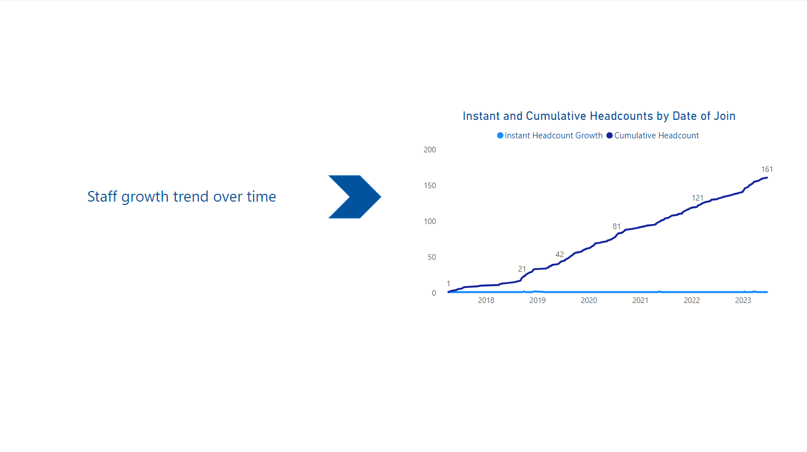

## HR Dashboard - Guided Power BI Project

Hello there. This is a guided project that I recently completed as an aspiring data analyst. See the live dashboard and other 9 requests below. 

Also, you can see my findings and recommendations as well as the features that I used. 

Live [dashboard](https://app.powerbi.com/view?r=eyJrIjoiZDBjYmI5NzYtNDk1Ni00YzY2LTlkMjAtNjRhY2RmY2ExOTZhIiwidCI6ImYxZDg2ZWI5LWFhZjEtNGZiNC05ODVlLTkxOWNkMGE1ODQzMSIsImMiOjl9)


- A good starting point to Power BI
- Credit: "Chandoo" YouTube Channel
- Reference [video](https://www.youtube.com/watch?v=5KaIU-9EF-0&t=0s) 
- I've followed the video and then modified/added several things myself, including the design.

See the other 9 requests below:

1) How many people work in each position?


2) Gender break-down of the staff


3) Age spread of the staff


4) Which jobs pay more?


5) Top 3 earners in each job


6) Education Level vs. Salary


7) Staff growth trend over time



8) Employee filter by starting letter


9) Leave Balance Analysis


### Dataset  

- 161 rows
- Columns: Name  |  Emp ID   |  Gender  |  Education Qualification  |  Date of Join  |  Job Title  |  Salary  |  Age  |  Leave Balance
- Explanation of Columns: Name --> Full name  Emp Id --> AC0001 to AC0161  Gender --> Male-Female

                          Education Qualification --> High School Diploma < Diploma < Bachelor's Degree < Master's Degree

                          Date of Join --> Full date  Job Title --> 10 unique titles  Salary --> in dollars

                          Age --> between 20 and 65 approximately with one decimal point

                          Leave Balance --> means how many vacation days left for you - positive whole number  

- Mostly clean, small adjustments made through Power Query

### Features that I used

- Power Query  --> New table and columns  | Data standardization  |  Column separation  |  Format adjustments
- Data Modeling --> Education Qualification column from the table staff is connected with Qualification column from the table qual (newly generated table)
- Bins --> Age (bins) - intervals with 5 age difference
- Measures --> Headcount  |  Avg Salary  |  Cumulative Headcount  |  Avg Leave Balance  |  Leave Balance over 20  |  Max Salary  |  Min Salary
- DAX codes for each measure
  - ```dax
    Headcount = COUNTROWS(staff)
    
    Avg Salary = AVERAGE(staff[Salary])
    
    Cumulative_headcount = 
      var currentDate = LASTDATE(staff[Date of Join])
    return
      CALCULATE([Headcount], ALL(staff[Date of Join]), staff[Date of Join]<= currentDate)

    Avg Leave Balance = AVERAGE(staff[Leave Balance])

    LB over 20 = CALCULATE([Headcount], staff[Leave Balance]>20)

    Max_salary = MAX(staff[Salary])

    Min_salary = MIN(staff[Salary])
    ```

### Findings

- More than half of the staff are in the age group 30-35. --> 85 of 161
- There is only one employee in the age group 20-25
- Leave balance seems too high. Although it depends on the time the data was collected, it may be a warning for possible burnouts in the company.
- Almost 55% of the staff are female
- Headcount is constantly rising over the years
- The trendline for salary by education level seems reasonable until checking it for each job title
  This kind of shows that the data used is just for demonstration purposes, which is true

### Recommendations

- Consider hiring interns for the future of the company
- Encourage using the vacation days to help reduce stress and burnouts
- Initiate young talent programs to decrease the average age

### What could be added?

- Years of experience could be used in a bubble chart along with salary and education level to get an overall idea. This can be done in Excel.

### Thank you!
